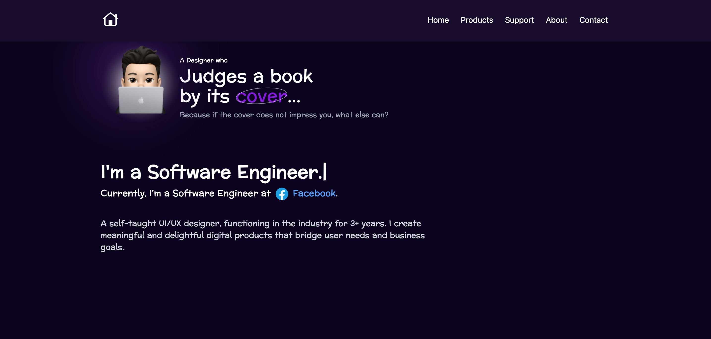
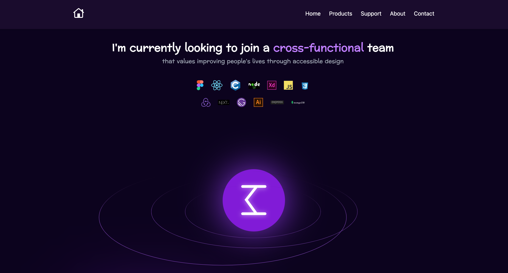
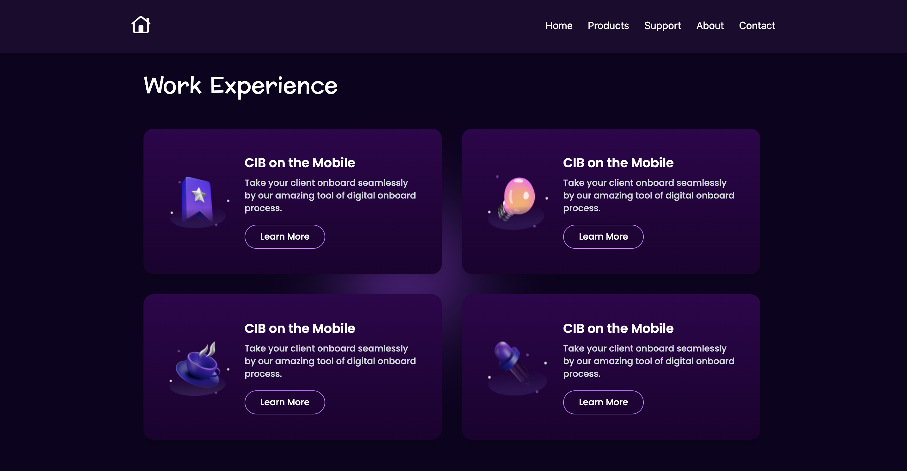
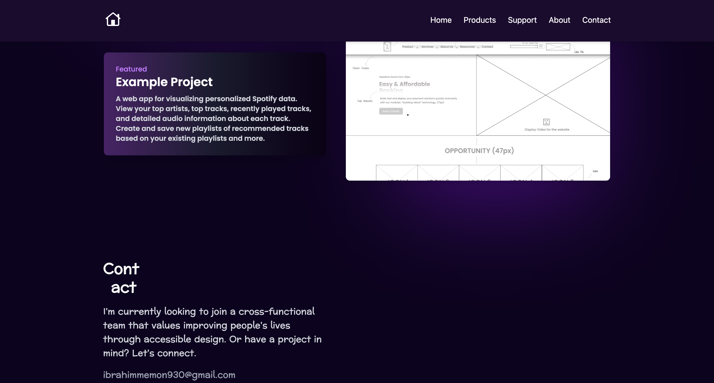

# TASK Landing Page

## 🏆 Frontend Developer Internship Task

This project is a **job task** for a **Frontend Developer Internship**. It is a modern and responsive **Landing Page** built using **React, TailwindCSS, and React Router**.

📌 **GitHub Repository**: [TASK Landing Page](https://github.com/Sabuj-Chowdhury/TASK-Landing-page)

🌍 **Live Demo**: [View Project](https://task-landing-page-pied.vercel.app/)

---

## 🛠️ Installation & Setup

### 🔹 Prerequisites

Make sure you have **Node.js (v18 or later)** and **npm/yarn** installed on your system.

### 🔹 Clone the Repository

```sh
 git clone https://github.com/Sabuj-Chowdhury/TASK-Landing-page.git
 cd TASK-Landing-page
```

### 🔹 Install Dependencies

```sh
 npm install  # or yarn install
```

### 🔹 Start Development Server

```sh
 npm run dev  # or yarn dev
```

After running the above command, the project should be available at:

```
http://localhost:5173
```

---

## 🔧 Technologies Used

- **React 19** - For building UI components.
- **React Router 7** - For navigation.
- **TailwindCSS 4** - For styling.
- **Vite** - For fast development.

### 📌 Dependencies

```json
"dependencies": {
  "@tailwindcss/vite": "^4.0.9",
  "react": "^19.0.0",
  "react-dom": "^19.0.0",
  "react-router-dom": "^7.2.0",
  "react-router-hash-link": "^2.4.3",
  "tailwindcss": "^4.0.9"
}
```

---

## 🚀 Deployment

This project is deployed on **Vercel**. If you want to deploy your own version:

1. Push your code to GitHub.
2. Create an account on [Vercel](https://vercel.com/).
3. Import your repository and deploy.

---

## 📸 Project Screenshots

### 🏠 Home Page



### 🛒 Product Section



### 🛠️ Services Section



### 🌟 Reviews & Footer



---
